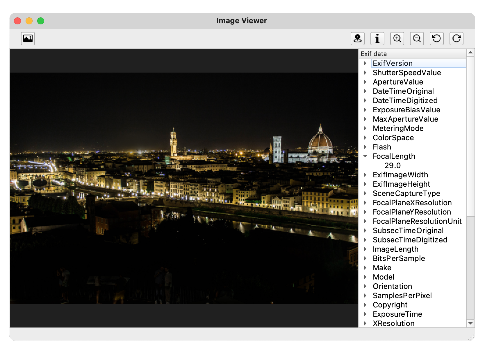

# SimpleViewer
[](https://opensource.org/licenses/mit-license.php)

Exif and image viewer built using PyQT5 framework 

## Features
- [x] Image rotation
- [x] Image zoom
- [x] Exif data viewer
- [x] Geotag support

## Screenshot


## Requirements
Library | Version
------------- | -------------
**[PyQt5](https://pypi.org/project/PyQt5/5.15.1/)**  | >= 5.15.4
**[Pillow](https://pypi.org/project/Pillow/8.0.1/)** | >= 8.0.1 

## Build instructions
1. Clone this repository:
```bash
git clone https://github.com/pzsette/SimpleViewer
```
2. Run:
```bash
python3 main.py
```
## Sample

[Sample JPG image](https://raw.githubusercontent.com/pzsette/SimpleViewer/master/sample/flr.jpg) with exif and Geotag data.

## License
MIT License. See [LICENSE](LICENSE) file for further information.
